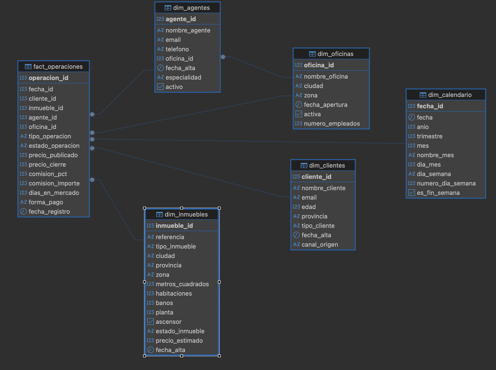
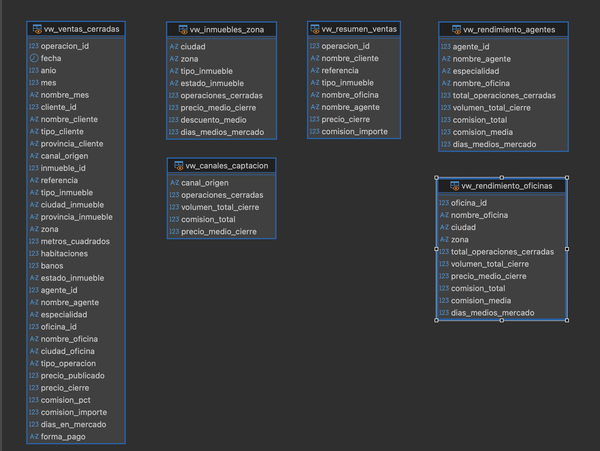

# 🏠 Proyecto SQL Inmobiliario

## Data Warehouse y Análisis de Negocio con PostgreSQL

## 📌 Descripción

Este proyecto consiste en el diseño, implementación y análisis de un **Data Warehouse inmobiliario** utilizando **PostgreSQL**.

El objetivo principal es simular un entorno empresarial real mediante la construcción de un modelo dimensional, la carga de datos sintéticos, la creación de vistas de negocio y el desarrollo de consultas SQL orientadas al análisis comercial e inmobiliario.

El proyecto reproduce escenarios habituales en una empresa del sector inmobiliario, incluyendo:

- Gestión de clientes compradores y vendedores.
- Gestión de agentes comerciales.
- Gestión de oficinas inmobiliarias.
- Gestión de inmuebles.
- Seguimiento de operaciones de venta, alquiler y reserva.
- Análisis de rendimiento comercial.
- Análisis de mercado inmobiliario.
- Evaluación de comisiones, descuentos y tiempos de comercialización.

---

## 🎯 Objetivos del Proyecto

- Diseñar un modelo dimensional tipo estrella (**Star Schema**).
- Implementar tablas de dimensiones y una tabla principal de hechos.
- Aplicar buenas prácticas de modelado relacional.
- Definir claves primarias, claves foráneas, restricciones e índices.
- Crear datos sintéticos realistas y controlados.
- Incorporar casos de calidad del dato para su posterior análisis.
- Construir consultas SQL descriptivas, analíticas y de negocio.
- Crear vistas reutilizables para análisis y herramientas BI.
- Preparar el modelo para una posible explotación posterior en Power BI.

---

## 🏗️ Estructura del Proyecto

```text
proyecto_sql_inmobiliaria/
│
├── sql/
│   ├── 01_schema.sql
│   ├── 02_data.sql
│   ├── 03_consultas.sql
│   ├── 04_views.sql
│   └── 05_eda.sql
│
├── imagenes/
│   ├── conexiones-entre-tablas.png
│   └── vistas.png
│
├── .gitignore
└── README.md
```

---

## 📊 Modelo Dimensional

El modelo sigue una estructura tipo estrella (**Star Schema**), con una tabla central de hechos y varias tablas de dimensión.

La tabla principal es `fact_operaciones`, que almacena cada operación comercial inmobiliaria. Alrededor de ella se conectan las dimensiones necesarias para analizar las operaciones desde diferentes perspectivas: cliente, inmueble, agente, oficina y calendario.

### Diagrama del modelo dimensional



## 📈 Vistas Analíticas del Proyecto

Las siguientes vistas encapsulan la lógica de negocio y facilitan el análisis comercial e inmobiliario sin necesidad de consultar directamente las tablas base.



---

## 🔑 Relaciones del Modelo

La tabla `fact_operaciones` se relaciona con las dimensiones mediante claves foráneas:

| Campo en `fact_operaciones` | Tabla relacionada | Campo relacionado |
|---|---|---|
| `cliente_id` | `dim_clientes` | `cliente_id` |
| `inmueble_id` | `dim_inmuebles` | `inmueble_id` |
| `agente_id` | `dim_agentes` | `agente_id` |
| `oficina_id` | `dim_oficinas` | `oficina_id` |
| `fecha_id` | `dim_calendario` | `fecha_id` |

Además, existe una relación adicional entre agentes y oficinas:

| Campo en `dim_agentes` | Tabla relacionada | Campo relacionado |
|---|---|---|
| `oficina_id` | `dim_oficinas` | `oficina_id` |

Esta relación permite analizar tanto la oficina asociada a cada operación como la oficina a la que pertenece cada agente comercial.

Representación simplificada:

```text
                 dim_calendario
                       │
                       │
dim_clientes ─── fact_operaciones ─── dim_inmuebles
                       │
                       │
                 dim_agentes
                       │
                       │
                 dim_oficinas
```

---

## 🧩 Tablas de Dimensión

### `dim_clientes`

Contiene información de clientes compradores, vendedores o clientes con ambos perfiles.

Incluye variables como:

- Nombre del cliente.
- Email.
- Edad.
- Provincia.
- Tipo de cliente.
- Fecha de alta.
- Canal de origen.

---

### `dim_agentes`

Contiene información de los agentes comerciales.

Incluye:

- Nombre del agente.
- Email.
- Teléfono.
- Oficina asociada.
- Fecha de alta.
- Especialidad comercial.
- Estado activo/inactivo.

---

### `dim_oficinas`

Recoge información de las oficinas inmobiliarias.

Incluye:

- Nombre de la oficina.
- Ciudad.
- Zona.
- Fecha de apertura.
- Estado de actividad.
- Número de empleados.

---

### `dim_inmuebles`

Contiene las características principales de los inmuebles comercializados.

Incluye:

- Referencia del inmueble.
- Tipo de inmueble.
- Ciudad y provincia.
- Zona.
- Metros cuadrados.
- Habitaciones.
- Baños.
- Estado del inmueble.
- Precio estimado.
- Fecha de alta.

---

### `dim_calendario`

Dimensión temporal utilizada para realizar análisis por fecha, mes, trimestre, año y día de la semana.

Permite analizar la evolución temporal de las operaciones inmobiliarias.

---

## 📌 Tabla de Hechos

### `fact_operaciones`

Tabla principal del modelo. Registra las operaciones comerciales realizadas o gestionadas.

Cada fila representa una operación inmobiliaria.

Incluye:

- Cliente asociado.
- Inmueble asociado.
- Agente responsable.
- Oficina asociada.
- Fecha de operación.
- Tipo de operación: venta, alquiler o reserva.
- Estado de la operación: cerrada, en proceso o cancelada.
- Precio publicado.
- Precio de cierre.
- Porcentaje de comisión.
- Importe de comisión.
- Días en mercado.
- Forma de pago.

---

## ⚙️ Tecnologías Utilizadas

- PostgreSQL 18
- DBeaver
- SQL
- Git
- GitHub

---

## 📈 Vistas de Negocio

El proyecto incorpora varias vistas analíticas para facilitar la explotación del modelo.

### `vw_ventas_cerradas`

Vista de operaciones cerradas con información integrada de clientes, inmuebles, agentes, oficinas y calendario.

### `vw_rendimiento_oficinas`

Permite analizar el rendimiento comercial por oficina: operaciones cerradas, volumen total, comisión total, comisión media y días medios en mercado.

### `vw_rendimiento_agentes`

Permite analizar la productividad individual de los agentes comerciales.

### `vw_inmuebles_zona`

Permite estudiar el comportamiento de los inmuebles por ciudad, zona, tipología y estado.

### `vw_canales_captacion`

Permite analizar la aportación de cada canal de captación de clientes.

---

## 🔍 Análisis Exploratorio de Datos (EDA)

El archivo `05_eda.sql` incluye consultas para analizar la calidad del dato y obtener conclusiones de negocio.

El EDA incluye:

- Detección de valores nulos.
- Clientes por provincia.
- Clientes por canal de captación.
- Precio medio por ciudad.
- Precio medio por tipo de inmueble.
- Metros medios por tipología.
- Ventas por oficina.
- Ventas por agente.
- Evolución temporal de ventas.
- Top zonas por operaciones.
- Descuento medio aplicado.
- Días medios en mercado.
- Resumen ejecutivo de operaciones cerradas.

---

## 📌 Técnicas SQL Utilizadas

El proyecto aplica diferentes técnicas de SQL básico y avanzado:

- `CREATE TABLE`
- `PRIMARY KEY`
- `FOREIGN KEY`
- `CHECK`
- `UNIQUE`
- `DEFAULT`
- `INSERT`
- `UPDATE`
- `DELETE`
- `CAST`
- Funciones de fecha
- `INNER JOIN`
- `LEFT JOIN`
- `GROUP BY`
- `HAVING`
- `CASE`
- Subconsultas
- CTEs (`WITH`)
- CTEs encadenadas
- Funciones ventana (`RANK() OVER`)
- Transacciones (`BEGIN`, `COMMIT`, `ROLLBACK`)
- Índices
- Vistas
- Funciones SQL

---

## 📊 Dataset Sintético

El proyecto utiliza datos sintéticos diseñados específicamente para simular un entorno inmobiliario real.

| Elemento | Total |
|---|---:|
| Clientes | 15 |
| Agentes | 12 |
| Oficinas | 6 |
| Inmuebles | 20 |
| Operaciones | 30 |
| Vistas analíticas | 5 |

Los datos incluyen casos controlados para poder trabajar la calidad del dato, como valores nulos, operaciones canceladas, operaciones en proceso y clientes sin operaciones asociadas.

---

## 📈 Resultados Obtenidos

El modelo permite responder preguntas de negocio como:

- ¿Qué oficina genera mayor volumen de comisiones?
- ¿Qué agentes tienen mejor rendimiento comercial?
- ¿Qué zonas concentran más operaciones?
- ¿Qué tipos de inmueble tienen mayor rotación?
- ¿Cuál es el descuento medio entre precio publicado y precio de cierre?
- ¿Cuánto tardan de media los inmuebles en comercializarse?
- ¿Qué canales de captación generan más operaciones?
- ¿Cómo evolucionan las ventas por año y mes?

---

## 🚀 Posibles Evoluciones

El proyecto puede ampliarse con nuevas funcionalidades:

- Integración con Power BI.
- Creación de un dashboard comercial.
- Automatización de procesos ETL.
- Generación masiva de datos sintéticos.
- Modelos predictivos de precio de cierre.
- Segmentación avanzada de clientes.
- Forecast de operaciones inmobiliarias.
- Análisis de rentabilidad por oficina y zona.

---

## ▶️ Orden de Ejecución

Para reproducir el proyecto desde cero, ejecutar los scripts en este orden:

```text
1. sql/01_schema.sql
2. sql/02_data.sql
3. sql/03_consultas.sql
4. sql/04_views.sql
5. sql/05_eda.sql
```

---

## 👨‍💻 Autor

**Job Delgado**

Proyecto desarrollado como práctica avanzada de SQL, modelado dimensional y análisis de datos orientado al sector inmobiliario.